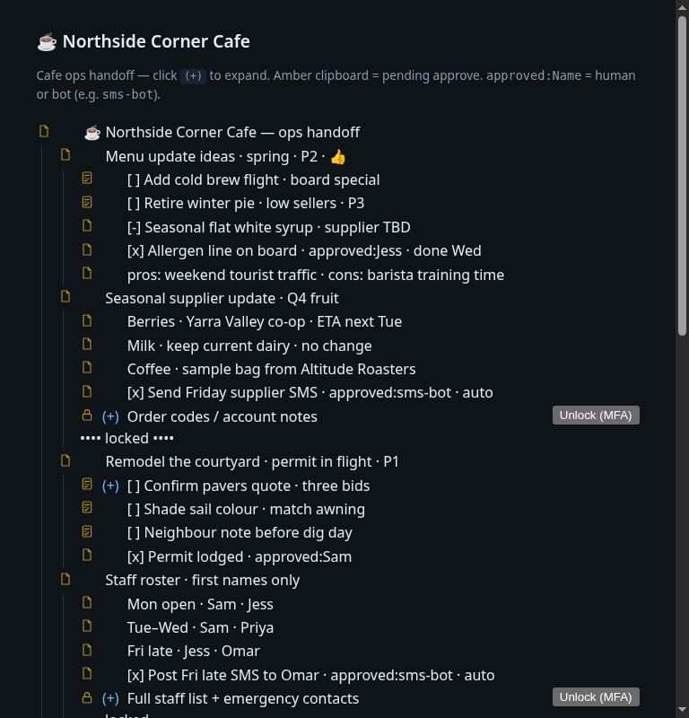
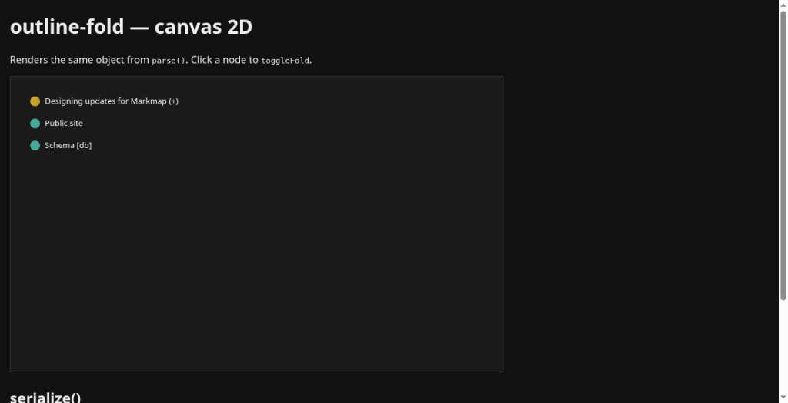

# @audroam/outline-fold

Pure TypeScript **outline language** for structured operational handoffs: parse / serialize, `fold-` / `fold+`, toggle, icons, and `toHtml`.
**MIT.** Host apps own production authentication, encryption, and database drivers.

```bash
npm i   # from this repo
npm test
npm run build
npx serve -l 4173 .   # then open the live demos below
```

## Live demos (HTML + JS + React)

**Static HTML** — after `npm run build` and `npx serve -l 4173 .`:

| Demo | URL |
|------|-----|
| **Cafe ops outline** — menu, suppliers, courtyard, and private handoff notes | [examples/outline-demo.html](./examples/outline-demo.html) → `http://127.0.0.1:4173/examples/outline-demo.html` |
| Cafe ops 2D map | [examples/canvas-2d/](./examples/canvas-2d/) → `http://127.0.0.1:4173/examples/canvas-2d/` |
| Cafe ops 3D map | [examples/3d/](./examples/3d/) → `http://127.0.0.1:4173/examples/3d/` |

**React live parser** (OSS example — textarea → `parse` / `toHtml`, fold via `toggleFold` + `serialize` sync; not the Audroam Angular SPA):

```bash
npm run demo:react
# → http://127.0.0.1:5173/
# or: npm run build && npx vite --config examples/react-live/vite.config.ts
```

| Demo | Path |
|------|------|
| React online parser | [examples/react-live/](./examples/react-live/) → `http://127.0.0.1:5173/` |

Source outline for the cafe handoff: [examples/outline-demo.md](./examples/outline-demo.md).

### Screenshots






## Sample (caption-first ids)

Cafe ops handoff — bots and humans share one outline. **Ids trail the caption.** Pending sign-off uses `<kind:pending-approve>`. Done rows name who approved (`approved:Jess` or auto `approved:sms-bot`):

```text
---
fold-: courtyard-quotes, payroll, alarm, staff-private
collapsedMarker: "(+)"
---
- ☕ Northside Corner Cafe — ops handoff <id:root>
  - Menu update ideas · spring · P2 · 👍 <id:menu>
    - [ ] Add cold brew flight · board special <kind:pending-approve> <id:menu-coldbrew>
    - [ ] Retire winter pie · low sellers · P3 <kind:pending-approve> <id:menu-pie>
    - [x] Allergen line on board · approved:Jess · done Wed <id:menu-allergen>
    - [x] Send Friday supplier SMS · approved:sms-bot · auto <id:sup-sms>
  - Remodel the courtyard · permit in flight · P1 <id:courtyard>
    - [ ] Confirm pavers quote · three bids <kind:pending-approve> <id:courtyard-quotes> (+)
    - [x] Permit lodged · approved:Sam <id:courtyard-permit>
```

Leading `<id:…>` is still accepted for backward compatibility; `serialize` always emits caption-first.

## Locked grammar (v0)

| Rule | Meaning |
|------|---------|
| `<id:design>` | Typed id span (optional short `<design>` also OK) — **leading or trailing** |
| `(+)` | **Collapsed** — click to expand. Expanded nodes show **no** `(+)` |
| Hyphens in ids | Legal (`todo-1`). **Do not** use `-` as a fold operator on ids |
| `fold-` | Default **expanded**; list = **collapsed** ids only |
| `fold+` | Default **collapsed**; list = **expanded** ids only — never both |
| Markers | Frontmatter `collapsedMarker` (default `(+)`), optional `expandedMarker` |

### Optional kinds / flags (model only)

```text
- Payroll portal notes <private> <id:payroll>
- Alarm arming notes <encrypted> <id:alarm>
- Cafe supplier account <kind:ticket> <id:supplier-account>
- Courtyard project <kind:feature> <id:courtyard>
- Menu change awaiting sign-off <kind:pending-approve> <id:menu-signoff>
```

Icons include doc, ticket, globe, db, feature, form, bug, risk, lock, encrypted, mfa, system-link, and pending-approve (an amber clipboard-check for human sign-off).
`toHtml` can render locked chrome + Unlock/Decrypt buttons. Wire host callbacks for real authentication/crypto — **none ship in this package.**

## API

```ts
import {
  parse,
  serialize,
  toggleFold,
  isCollapsed,
  toHtml,
  ICONS,
} from '@audroam/outline-fold';

const doc = parse(text);
isCollapsed(doc, 'courtyard');
const next = toggleFold(doc, 'courtyard'); // pure — bind the returned object, no re-parse on click
const html = toHtml(next);
```

## Host integration

1. `doc = parse(savedText)` once  
2. Bind UI to `doc`  
3. On `(+)` click → `doc = toggleFold(doc, id)`  
4. On save → `serialize(doc)`

## Security boundary

| In this package | In the host app |
|-----------------|-----------------|
| Grammar, fold state, icons, HTML chrome | Authentication / MFA challenge |
| `onUnlock` / `onDecrypt` **types** | Key management, decrypt |
| `db` flag + `dbRef` string | Connection pools, credentials |

## License

MIT © 2026 Colin Wirt / Audroam
