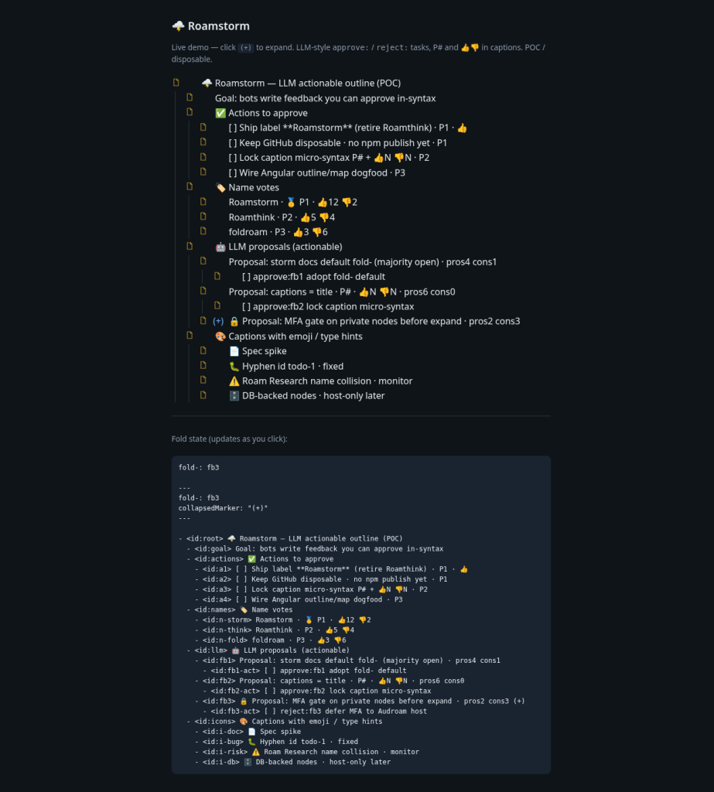
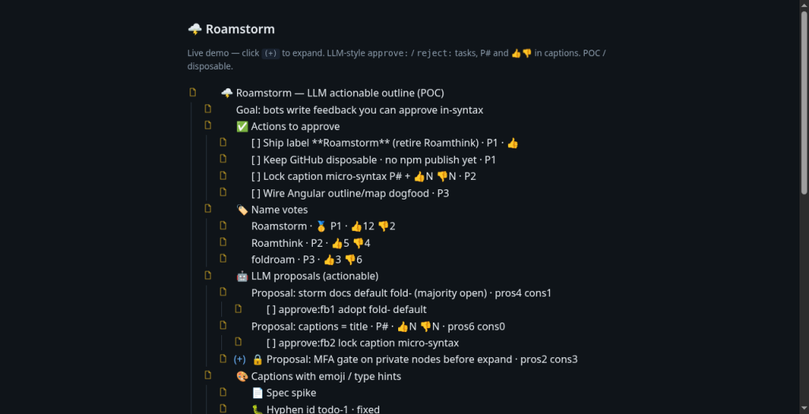

# @audroam/outline-fold

> **POC / workshop name: Roamstorm** — disposable sketch; may delete this repo later. Final package name TBD.

Pure TypeScript **outline language**: parse / serialize, `fold-` / `fold+`, toggle, icons, and `toHtml`.  
**MIT.** Host apps (e.g. Audroam) own real MFA, encryption, and database drivers.

```bash
npm i   # from this repo
npm test
npm run build
npx serve -l 4173 .   # then open the live demos below
```

## Live demos (HTML + JS)

Open after `npm run build` and `npx serve -l 4173 .`:

| Demo | URL |
|------|-----|
| **Roamstorm** — LLM actionable outline (approve/reject, P#, votes, fold) | [examples/roamstorm-demo.html](./examples/roamstorm-demo.html) → `http://127.0.0.1:4173/examples/roamstorm-demo.html` |
| Canvas 2D map | [examples/canvas-2d/](./examples/canvas-2d/) → `http://127.0.0.1:4173/examples/canvas-2d/` |
| 3D example | [examples/3d/](./examples/3d/) → `http://127.0.0.1:4173/examples/3d/` |

Source outline for the Roamstorm demo: [examples/roamstorm-demo.md](./examples/roamstorm-demo.md).

### Screenshots






## Roamstorm sample (LLM coms)

Bots and humans can share the same artifact — tasks to approve, priority and votes in captions, fold memory in frontmatter:

```text
---
fold-: n-think, fb3
collapsedMarker: "(+)"
---
- <id:root> 🌩️ Roamstorm — LLM actionable outline (POC)
  - <id:actions> ✅ Actions to approve
    - <id:a1> [ ] Ship label **Roamstorm** · P1 · 👍
    - <id:a2> [ ] Keep GitHub disposable · P1
  - <id:names> 🏷️ Name votes
    - <id:n-storm> Roamstorm · 🥇 P1 · 👍12 👎2
    - <id:n-think> Roamthink · P2 · 👍5 👎4 (+)
  - <id:llm> 🤖 LLM proposals
    - <id:fb1> Proposal: storm docs default fold- · pros4 cons1
      - <id:fb1-act> [ ] approve:fb1 adopt fold- default
    - <id:fb3> 🔒 MFA on private nodes · pros2 cons3 (+)
      - <id:fb3-act> [ ] reject:fb3 defer MFA to host
```

## Locked grammar (v0)

| Rule | Meaning |
|------|---------|
| `<id:design>` | Typed id span (optional short `<design>` also OK) |
| `(+)` | **Collapsed** — click to expand. Expanded nodes show **no** `(+)` |
| Hyphens in ids | Legal (`todo-1`). **Do not** use `-` as a fold operator on ids |
| `fold-` | Default **expanded**; list = **collapsed** ids only |
| `fold+` | Default **collapsed**; list = **expanded** ids only — never both |
| Markers | Frontmatter `collapsedMarker` (default `(+)`), optional `expandedMarker` |

### Optional kinds / flags (model only)

```text
- <id:secret> <private> Payroll notes
- <id:vault> <encrypted> Client keys
- <id:conn> <db:prod-pg> Schema map
- <id:feat> <kind:feature> New map layer
```

Icons include doc, ticket, globe, db, feature, form, bug, risk, lock, encrypted, mfa, system-link.  
`toHtml` can render locked chrome + Unlock/Decrypt buttons. Wire host callbacks for real MFA/crypto — **none ship in this package.**

## API

```ts
import {
  parse,
  serialize,
  toggleFold,
  isCollapsed,
  toHtml,
  ICONS,
} from '@audroam/outline-fold';

const doc = parse(text);
isCollapsed(doc, 'design');
const next = toggleFold(doc, 'design'); // pure — Angular binds the object, no re-parse on click
const html = toHtml(next);
```

## Angular dogfood (host)

1. `doc = parse(savedText)` once  
2. Bind UI to `doc`  
3. On `(+)` click → `doc = toggleFold(doc, id)`  
4. On save → `serialize(doc)`

## Security boundary

| In this package | In the host (Audroam, etc.) |
|-----------------|-----------------------------|
| Grammar, fold state, icons, HTML chrome | MFA / TOTP challenge |
| `onUnlock` / `onDecrypt` **types** | Key management, decrypt |
| `db` flag + `dbRef` string | Connection pools, credentials |

## License

MIT © 2026 Colin Wirt / Audroam
